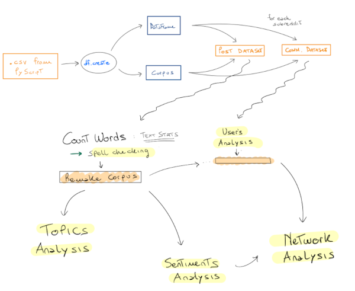
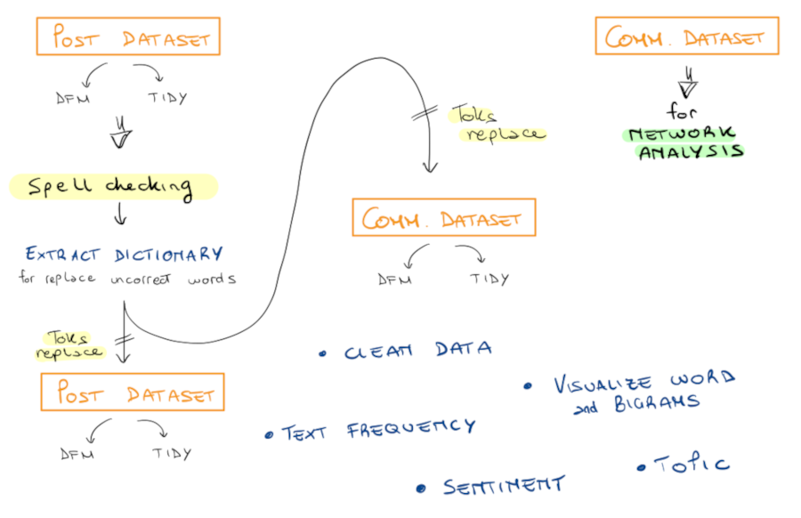
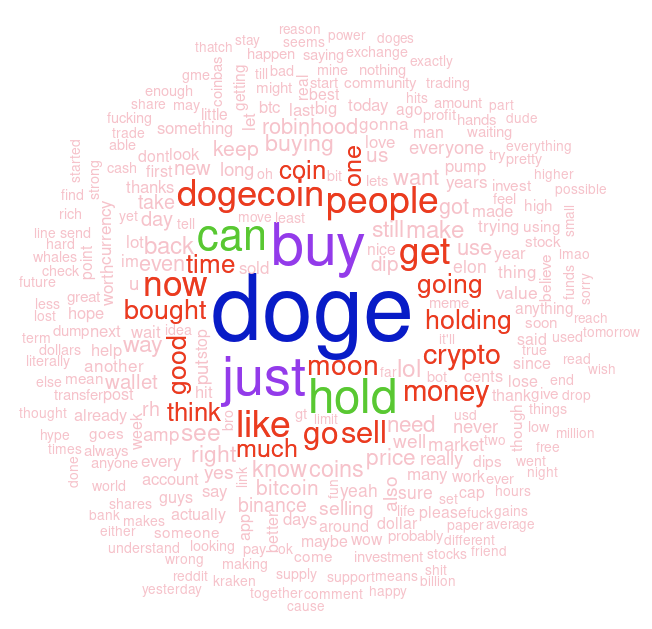
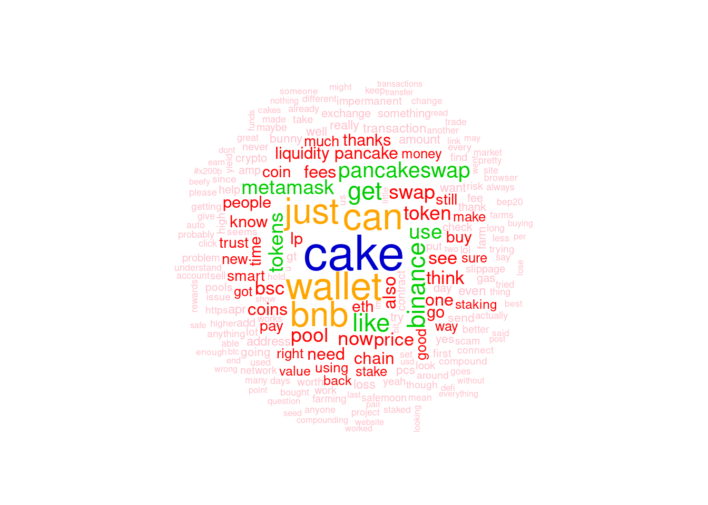
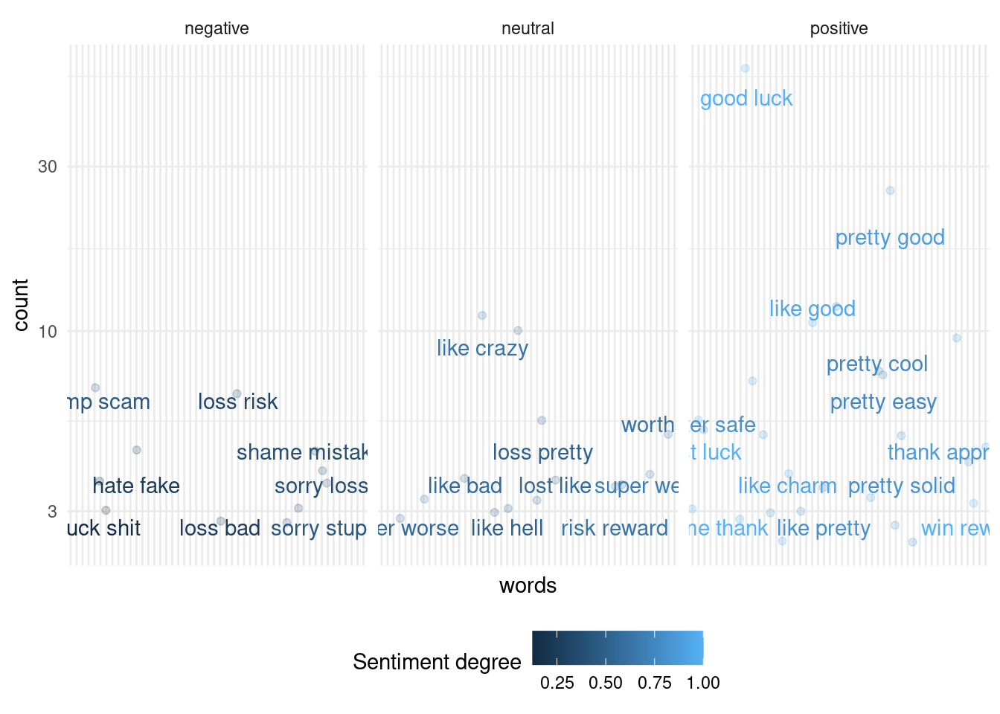
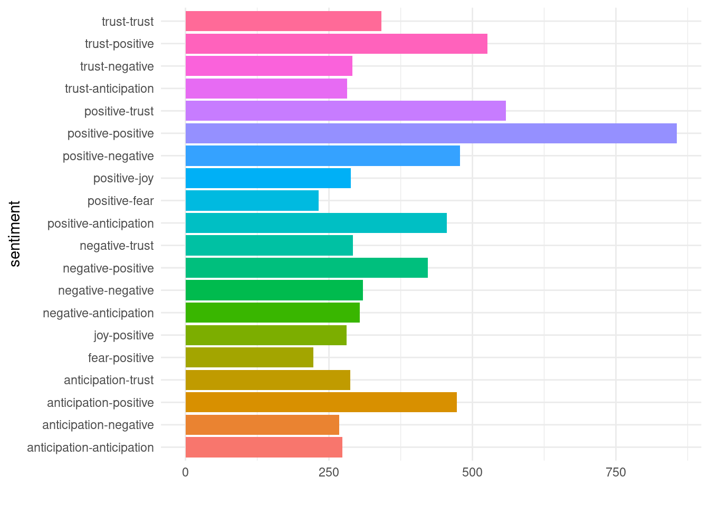
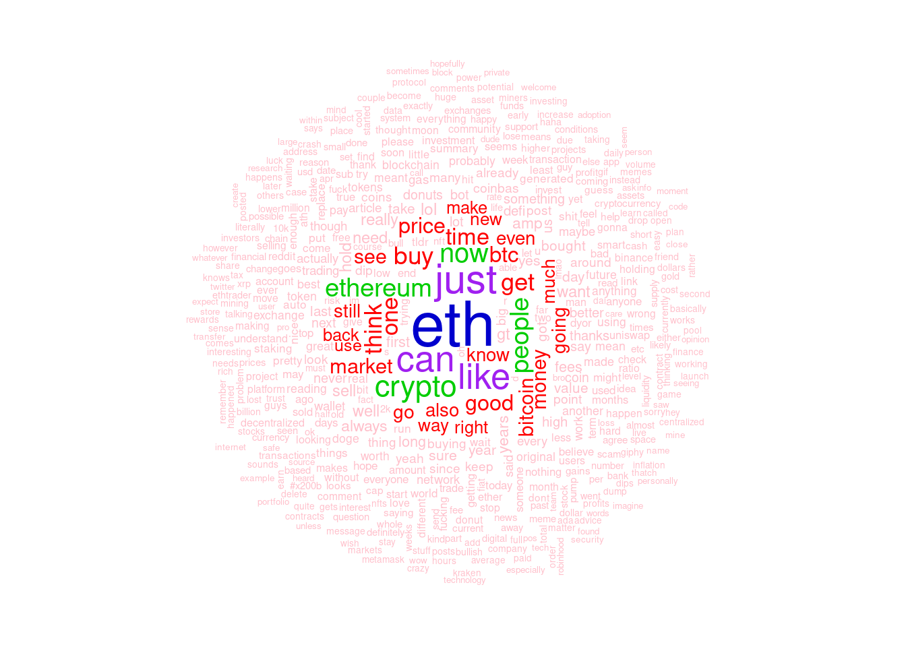
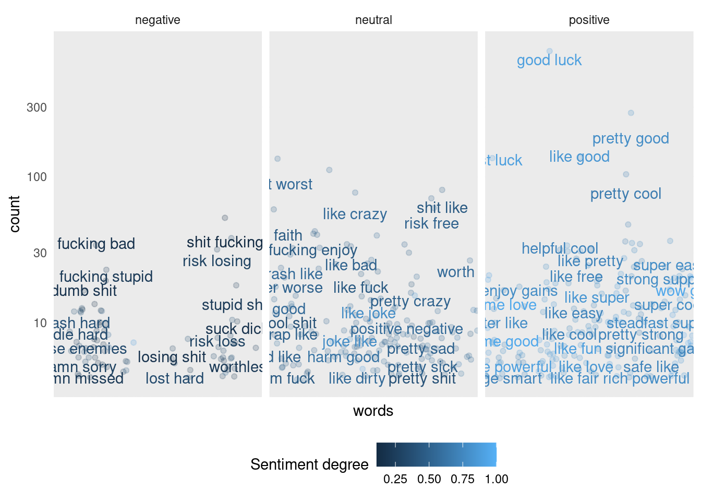
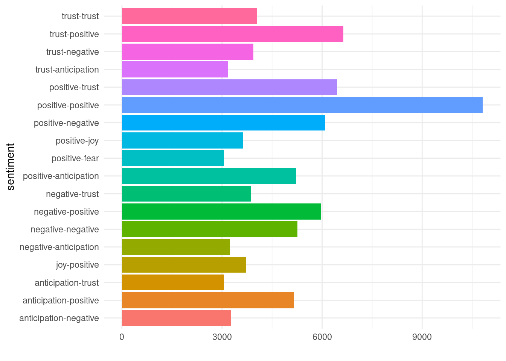

```{r setup, include=FALSE}
knitr::opts_chunk$set(echo = FALSE, 
                      warning = FALSE,
                      error = FALSE, 
                      out.width = "80%", 
                      fig.align="center", 
                      results = 'hide')

source("../src/lib.R")
source("../src/functions.R")
```

```{r xaringan-themer, include=FALSE, warning=FALSE}
library(xaringanthemer)

style_mono_accent(
  base_color = "#2196f3",
  text_color = "#263238",
  colors  = c(
    red = "#f34213",
    purple = "#3e2f5b",
    orange = "#ff8811",
    green = "#136f63"
  ), 
  base_font_size = "24px",
  text_font_size = "24px",
  header_font_google = google_font("Ubuntu"),
  text_font_google   = google_font("Source Code Pro", "400", "100i"),
  code_font_google   = google_font("Fira Mono"), 
)


# extra_css = list(
#     ".scroll-slide" = list("height" = "800px",
#                             "overflow-y" = "auto !important")
#   )
# 
# style_extra_css(css = extra_css, outfile = "style_presentation.css")
```

## Introduzione

Il progetto si pone come obiettivo quello di **raccogliere** ed **analizzare** i commenti relativi al Reddit di _Dogecoin_. Si andrà poi a compararli con i risultati di altri dataset raccolti ( _Bitcoin, Ehtereum, PancakeSwap_ ). 


Domande iniziali: 

> - Quali sono gli utenti maggiormente attivi?

> - Quali sono le parole e i bigrammi più utilizzati? 

> - Ci potrebbe essere una relazione tra i sentimenti dei commenti e gli eventi sociali/economici? 

> - Gli utenti più attivi possono esser considerati affidabili? 

> - Tra le diverse comunità c'è una differenza nel modo di esprimersi e negli argomenti trattati? 


## Reddit


* è un **social network aggregator**.

* non si hanno relazioni di amicizia tra utenti.

* c'è anonimità riguardo il nome degli utenti, ma non sulle attività.

* ogni utente può seguuire diversi forums ( _subreddit_ ).

* ogni **subreddit** tratta un argomento specifico.

* utenti come creatori di contenuti, fruitori e moderatori.

## Collect Data with Python

Per recuperare i dati del 2020 e del 2021 si è utilizzato un wrapper della libreria **Pushshift**. 

Si è utilizzata la versione che sfrutta il **multithreading** in modo da accellerare il recupero delle informazioni. 

Definendo una classe **Miner** con parametri: 

> - Api key

> - Intervallo di tempo 

> - Nome del subreddit d'interesse


Si istanzia un oggetto Miner per ogni subreddit d'interesse in modo da eseguire la ricerca in parallelo. 


## Pipeline of Work {.flexbox .vcenter .fullslide}



## {.flexbox .vcenter}



## Text Analysis 


|      DogeCoin Corpus** | Type  | # Comment | # Post *  |
| -------------------: | ----- | --------- | --------- |
|         #num of docs | Raw   | 1,956,662 |  185,823  |
|                      | Clean | 1,848,743 |  182,679  |
|         #num of toks | Raw   | 198,537   |  198,709  |
|                      | Clean | 140,231   |  140,241  |
|                      |       |           |           |
| #num of docs bigrams | Raw   | 1,956,656 |  185,823  |
|                      | Clean | 1,569,893 |  172,952  |
| #num of toks bigrams | Raw   | 3,597,421 | 4,165,904 |
|                      | Clean | 3,189,821 | 3,646,399 |
```
* with stop words
** tokens not unique 
```

## Spell Checking {.scrol-slide}


|      DogeCoin Corpus | Type  | # Original Post | # Post *  |
| -------------------: | ----- | --------- | --------- | 
|         #num of docs | Raw   |  185,823  |  183,609  | 
|                      | Clean |  182,679  |  182,646  | 
|         #num of toks | Raw   |  198,709  |  198.473  | 
|                      | Clean |  140,241  |  140,175  | 
|     # hunspell check | TRUE  |  36,086   |  36,118   | 
|                      |       |           |     |    
| #num of docs bigrams | Raw   | 185,823   |  185,823  | 
|                      | Clean | 172,952   |  174,777  | 
| #num of toks bigrams | Raw   | 4,165,904 | 3,159,569 | 
|                      | Clean | 3,646,399 | 2,316,567 | 
```
* with spell checker 
```

## Terms and Bigrams {.scrol-slide}

```{r results='hold'}
data <- readRDS("../Data/dogecoin.rds")
doge_corpus <- data$corpus_comm
remove(data)

# remove stopwords!!              
doge_tidy <- corpus.tokenize_dfmTidy(doge_corpus, 
                                     spell_checking = TRUE, 
                                     mode_correction = 0)
doge_clean_tidy <- corpus.clean_tidy(doge_tidy$tidy, mode='stem' )

doge_word_counts <- corpus.countPlot_tidy(doge_clean_tidy, threshold_count = 2000)

```

##

```{r result='hold'}
doge_clean_tidy_bigrams <- readRDS("../Data/bigrams_clean.rds")
doge_bigrams_counts <- corpus.countPlot_tidy(doge_clean_tidy_bigrams, 
                                                   threshold_freq = 0.0003,
                                                   ngrams = 2)
```

## {.vcenter .flexbox}



## Sentiment Analysis {.scrol-slide}

```{r}
words.classSentiment(doge_word_counts)
```

## Sentiments per Words {.scrol-slide}

```{r}
words.computeSentiment(doge_word_counts, n_filter = 10)
```

## Sentiments per Bigrams {.scrol-slide}

```{r}
words.computeSentiment(doge_bigrams_counts, n_filter = 50, ngrams = 2)
```

## Bigrams Network

```{r}
words.network(doge_bigrams_counts, n_filter = 2000)
```

## LDA - Topic Analysis  {.flexbox .vcenter}

```{r}
data <- readRDS("../Data/dogecoin.rds")
doge_corpus <- data$corpus_post
remove(data)

              
doge_tidy <- corpus.tokenize_dfmTidy(doge_corpus, 
                                     spell_checking = TRUE, 
                                     mode_correction = 0)

remove( doge_corpus)

dfmTrimmed <- dfm_trim(doge_tidy$dfm, min_docfreq = 100, min_termfreq = 5000)
remove(doge_tidy)
# delete row with all zeros 
rowSum <- apply(dfmTrimmed , 1, sum)
dfmTrimmed <- dfmTrimmed[rowSum> 0, ]
remove(rowSum)

library(topicmodels)
# Latent Dirichlet allocation
doge_lda <- LDA(dfmTrimmed, k = 4, control = list(seed = 123456789))
remove(dfmTrimmed)

doge_topics <- tidy(doge_lda, matrix = 'beta')

# the 10 terms that are most common within each topic
doge_top_terms <- doge_topics %>%
  group_by(topic) %>%
  top_n(10, beta) %>%
  ungroup() %>%
  arrange(topic, -beta)

#head(doge_top_terms, 5)
remove(doge_topics)

doge_top_terms %>%
  mutate(term = reorder_within(term, beta, topic)) %>%
  ggplot(aes(term, beta, fill = factor(topic))) +
  geom_col(show.legend = FALSE) +
  facet_wrap(~ topic, scales = "free") +
  coord_flip() +
  scale_x_reordered()

remove(dfmTrimmed, doge_lda, doge_top_terms, doge_topics)
```

## Sentiment Polarity {.scrol-slide}

> Sentiment polarity for an element defines the orientation of the expressed sentiment, i.e., it determines if the text expresses the positive, negative or neutral sentiment of the user about the entity in consideration.

$$
   polarity = (pos + neut*0.4) - (neg + neut*0.6)
$$

```{r}
data <- readRDS("../Data/dogecoin.rds")
doge_df <- data$df_comm
#doge_corpus <- data$corpus_comm


remove(data)

plot_com_per_date <- function(dataset){

   df_date <- dataset %>%
      select(date, link_id) 
      
   plot <- 
      df_date%>%
      group_by(date) %>%
      # retrieve comments for day 
      summarise(n_com = n()) %>%
      arrange(date) %>%
      # plot..
      ggplot(aes(date, n_com)) +
         geom_line(size = 0.3) +
         xlab("Date") + 
         ylab("Number of Comment") + 
         scale_y_log10() + 
         geom_vline(xintercept = as.Date('2020-07-01'), color = 'green3', size = 0.2) +
         geom_vline(xintercept = as.Date('2021-01-01'), color = 'orangered1', size = 0.2) +
         geom_vline(xintercept = as.Date('2021-02-01'), color = 'orangered1', size = 0.2) +
         geom_vline(xintercept = as.Date('2021-03-01'), color = 'orangered1', size = 0.2) +
         geom_vline(xintercept = as.Date('2021-04-01'), color = 'orangered1', size = 0.2) +
         geom_vline(xintercept = as.Date('2021-05-01'), color = 'grey', size = 0.2) +
         theme_minimal()
   
   print(plot)
}


doge_clean_tidy_bigrams <- readRDS("../Data/bigrams_clean.rds")

# sentiment per comment 
sent_per_comm_dogeBi <- corpus.compute_sentiment_per_comment(doge_clean_tidy_bigrams, doge_df)

remove(doge_clean_tidy_bigrams)

Bi_per_id <- sent_per_comm_dogeBi %>% 
   group_by(id) %>%
   count()

#max(Bi_per_id$n)
sent_per_comm_dogeBi = sent_per_comm_dogeBi %>% inner_join(Bi_per_id, by = "id")

remove(Bi_per_id)
sigmoid <- function(x) {
   sig = 1 / (1 + exp(-{{x}}))
   return(sig)
}

fatt <- function(x){
    ifelse(x == 1, 1, x * fatt(x-1))
}

over_time_sentiment <- sent_per_comm_dogeBi %>%
         count(bing, id) %>%
   # aggregate split with count of sentiment
         spread(bing, n, fill = 0) %>%
   # for each comment pos, neg, neut count 
         mutate(polarity = (positive + neutral*0.4) - (negative + neutral*0.6)) %>%
   # if pol is neg -> neg 
         mutate(polarity = as.numeric(polarity)) %>%
   # dimension of comment (bigrams count) 
         rowwise() %>%
         mutate(dim = sum(positive, negative, neutral)) %>%
   # dividiamo la polarità per il fattoriale di dimensione e dividiamo per la dimensione
   # In questo modo i commenti con maggior numero di bigrammi avrà un peso molto maggiore agli altri
         mutate(polarity_dim =  as.double(polarity) / fatt(dim) ) %>%
   # standardizziamo tra [0,1] e [-1, 1]
         mutate(polarity_sig_dim = sigmoid(polarity_dim)) %>%
         mutate(polarity_tan_dim = tanh(polarity_dim)) %>%
         mutate(polarity_sig = sigmoid(polarity)) %>%
         mutate(polarity_tan = tanh(polarity))

```

```{r results='hold'}
head(over_time_sentiment, 5)
```

## Polarity Distribution {.scrol-slide}

```{r}

# dist of polarity values
h1 <- ggplot(over_time_sentiment) + 
   geom_histogram(aes(polarity), bins = 20) + 
   theme_minimal()

# normalize with sigmoid
h2 <- ggplot(over_time_sentiment) + 
   geom_histogram(aes(polarity_sig), bins = 20) + 
      ylab("") + 
   theme_minimal()

# normalize with tanh
h3 <- ggplot(over_time_sentiment) + 
   geom_histogram(aes(polarity_tan), bins = 20) + 
      ylab("") + 
   theme_minimal()

print(h1 + h2 + h3)
```

## Number of Comments

```{r}
plot_com_per_date(doge_df)
```


## Over Time Sentiment {.vcenter .scrol-slide}

```{r}
# re-join date 
over_time_sentiment_join <- over_time_sentiment %>% 
   inner_join(sent_per_comm_dogeBi, by = "id") %>%
   select(date, id, polarity_tan, author) 
remove(sent_per_comm_dogeBi)

# date sentiment
over_time_sentiment <- over_time_sentiment_join %>%
   select(date, polarity_tan) %>% # polarity , polarity_tan_dim
   group_by(date) %>%
   summarise_at(vars(polarity_tan), funs(mean(., na.rm=TRUE)))

# comment sentiment 
sentiment_id <- over_time_sentiment_join %>%
   select(id, polarity_tan) %>% # polarity , polarity_tan_dim
   group_by(id) %>%
   summarise_at(vars(polarity_tan), funs(mean(., na.rm=TRUE)))

# author sentiment
# replace na with 0 !! 
sentiment_author <- over_time_sentiment_join %>%
   select(author, polarity_tan) %>% # polarity , polarity_tan_dim
   group_by(author) %>%
   summarise_at(vars(polarity_tan), funs(mean(.)))


p1 <- plot_year_sentiment(over_time_sentiment, "2020", polarity_tan)    # date sentiment mean

p2 <- plot_year_sentiment(over_time_sentiment_join, "2020", polarity_tan)  

print(p1$plot + p2$plot)
remove(p1, p2)
```

## Over Time Sentiment 2021 {.vcenter .scrol-slide}

```{r}
dogeusd <- read.csv("../Data/DOGE-USD.csv")

s <- plot_year_sentiment(over_time_sentiment_join, "2021", polarity_tan)

p <- dogeusd %>%
   mutate(Date = as.Date(Date)) %>%
   filter( year(Date) == "2021") %>%
   mutate(month = month(Date)) %>%
   mutate(Low = as.double(Low)) %>%
   mutate(High = as.double(High)) %>%
   mutate(dayMonth = as.numeric(day(Date))) %>%
      # plot..
      ggplot(aes(x=dayMonth, y=Low)) +
         geom_line( color = 'red', size = 0.3 ) +
         geom_line(aes(y = High), color = 'green4', size = 0.3) +
         facet_grid(facets = month ~ ., margins = FALSE)+
         xlab("Date") + 
         ylab("Polarity") + 
         ggtitle("2021 - price of DOGE") +
         theme( plot.title = element_text(size = 9) , 
                axis.text.y = element_blank()) +
         theme_minimal()

print(s$plot + p)
remove(s, p)
```


## Network Analysis 

Non essendoci relazioni di amicizia o di followers, si è deciso di definire come relazione tra due utenti l'azione di commentare uno stesso post o commento. A causa dell'enorme quantità di dati rispetto al numero di nodi si è dovuto semplifacare ancor di più il grafo. 

**Nodi**: 

> - utenti con il maggior numero di commenti

**Features** per ogni utente: 

> - _score_ medio 

> - sentimento medio 

**Archi**: 

> - relazione -- "ha avuto un'interazione nello stesso commento/post" 


## Score Distribution {.flexbox .vcenter .scrol-slide}

```{r}
mean_score_usr <- readRDS("../Data/usr_score.rds")
# dist of polarity values
h1 <- ggplot(mean_score_usr) + 
   geom_histogram(aes(score), bins = 20) + 
   theme_minimal()

# normalize with sigmoid
h2 <- ggplot(mean_score_usr) + 
   geom_histogram(aes(score_nrm), bins = 20 ) + 
      ylab("log(count)") + xlab("score_nrm") +
   scale_y_log10() + 
   theme_minimal()


print(h1 + h2)
remove(h1, h2)

# write.csv(mean_score_usr, "../Data/usr_sent_score.csv")
remove(time_sent_aut_score)
```

## Score of Network 

```{r}

data <- readRDS("../Data/dogecoin.rds")
doge_df <- data$df_comm
remove(data)

net50usr <- compute_top_usr_net(doge_df, "../Data/top_usr_50.rds", 50)
mean_score_usr <- readRDS("../Data/usr_score.rds")
sentiment_author <- readRDS("../Data/sent_usr.rds")
remove(doge_df)

# head(net50usr, 3)

nodes <- net50usr$nodes
edges <- net50usr$edges

# join mean score and sentiment with user
nodes_ <- nodes %>%
   inner_join(mean_score_usr, by="author") 
  
nodes_ <- nodes_ %>%
   left_join(sentiment_author, by = "author") %>%
   mutate(polarity_tan = if_else(is.na(polarity_tan), 0, polarity_tan)) %>%
   select(author, polarity_tan, score, score_nrm)

hist(nodes_$score)
```


## Users Network {.flexbox .vcenter .scrol-slide}
 
```{r}
graph <- readRDS("../Data/graph_50.rds")

graph_undir <- graph %>%
   as.undirected(mode = 'collapse', edge.attr.comb = "first") %>%
   as_tbl_graph()

graph_undir %>% 
   activate(nodes) %>%
   # compute centrality 
   mutate(eigenv = centrality_eigen()) %>%
   ggraph(layout='kk') +
      geom_edge_link(aes(colour = post_id, alpha = 0.4),  show.legend = FALSE) + 
      geom_node_point(aes(size = eigenv, alpha = mean.score, color = sentiment.polarity), ) + 
      geom_node_text(aes(label = author), repel = TRUE)
```

## Betweenness {.flexbox .vcenter .scrol-slide}

```{r}
graph_undir %>% 
   activate(nodes) %>%
   # compute influence
   mutate(betweenness = centrality_betweenness()) %>%
   ggraph(layout='kk') +
   geom_edge_link(aes( colour = post_id), size=0.1, alpha = 0.3, show.legend = FALSE) +
   geom_node_point(aes(size = betweenness, color = sentiment.polarity) )+ 
   geom_node_text(aes(label = author),  repel = TRUE)
```

## Other Results - PancakeSwap  {.flexbox .vcenter .scrol-slide}







## Other Results - EthTrader  {.flexbox .vcenter .scrol-slide}





## References 

> - Advanced Data Science course. Prof. Massimo Franceschet. Università degli Studi di Udine - DMIF 

> - Benoit, Kohei Watanabe, Kenneth, and Akitaka Matsuo. 2018. “Quanteda: An r Package for the Quantitative Analysis of Textual Data.” Journal of Open Source Software

> - C. J. Hutto, Eric Gilbert. 2014. “VADER: A Parsimonious Rule-Based Model for Sentiment Analysis of Social Media Text.”

> - Németh, László, and contributors. HUNSPELL https://github.com/hunspell/hunspell.

> - Pano, Toni, and Rasha Kashef. 2020. “A Complete VADER-Based Sentiment Analysis of Bitcoin (BTC) Tweets During the Era of COVID-19.” Big Data and Cognitive Computing.

> - Thurner, Stefan, Rudolf Hanel, Bo Liu, and Bernat Corominas-Murtra. 2015. “Understanding Zipf’s Law of Word Frequencies Through Sample-Space Collapse in Sentence Formation.” Journal of The Royal Society Interface

